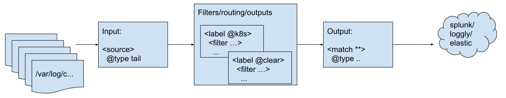

# Kubernetes logging: Controlling FluentD flow with annotations.

At work, we have been using FluentD for logging from our Openshift clusters for quite some time.
FluentD is versatile and flexible, and even though processing JSON-in-JSON can sometimes give
challenges, we're happy with it.

Our installation is not exactly best-practice, since it's a multitenancy setup with about 20
teams utilizing the same clusters. Some teams would like logging to work a little different
to accomodate their needs.

In the following a configuration of FluentD is given which accomplishes the following:

* Allow turning on/off logging on a namespace/pod level.
* Allow configuration for multiline logging on a namespace/pod level.
* Allow namespace/pod owners to control the settings by pod/namespace annotations.

Two annotations are introduced, which can be placed on either a Namespace or a Pod:
* `fluentd/include` -- if `true` log events from the container should be logged.
* `fluentd/multiline` -- if `true` multiline (e.g. JVM stack traces) log events from the container will be dealt with.


## FluentD Kubernetes configuration

The general FluentD configuration for Kubernetes looks somewhat like this:

* Input -- "source" tailing container logs from /var/log/containers.
* Filters -- enrich log record with Kubernetes metadata.
* Output -- forward logs to EFK (Elasticsearch) or similar log aggregator.

For the purpose of this demo the following is going to happen:



### Input: Reading Kubernetes container logs

For input container logs area read using the tail plugin in a `<source>` section:

```ruby
    <source>
      @id kubernetes.log
      @type tail
      @label @containers
      tag kubernetes.*
      path /var/log/containers/*.log
      exclude_path [
         "/var/log/containers/fluentd-k8s-*.log",
         "/var/log/containers/*_kube-system_*.log",
         "/var/log/containers/*_flux-system_*.log",
         "/var/log/containers/*_traefik-controller_*.log"
      ]
      pos_file /var/log/kubernetes.log.pos
      path_key source
      read_from_head true
      refresh_interval 60
      <parse>
        @type regexp
        expression /^(?<time>.+) (?<stream>stdout|stderr) [^ ]* (?<log>.*)$/
        time_format  %Y-%m-%dT%H:%M:%S.%N%:z
        time_key time
        time_type string
        localtime false
      </parse>
    </source>
```

The following highlights of this configuration are:
* `exclude_path` is used to initially filter out containers/namespaces without interest in getting logged. Here we don't want logs from kube-system and the traefik-controller, as it's a managed solution, as well as fluentd-k8s containers.
* `tag kubernetes.*` sets the tag of the emitted log event.
* `@label @containers` decides which route the source emits logs into.
* The `<parse>` section parses OCI container logging format.


### Routing and filters: Initial enrichment of Kubernetes log events

In the configuration the log events from the container files are emitted to the `@containers` label. This label starts
out with looking up Kubernetes metadata for the entry which is required later on:

```ruby
      <filter kubernetes.**>
        @type kubernetes_metadata
        @id id_kubernetes_metadata
        annotation_match [ "^fluentd" ]
        de_dot false
      </filter>
```

`annotation_match` is a filter on annotations, which can be left out. For the purpose of this demo only annotations starting
with `fluentd` are added to the log event record.

The next filter extracts two additional records to the log event, from the kubernetes part of the record. For this to work
ruby scripting is enabled, to build the search chain:

``` ruby
      <filter kubernetes.**>
        @type record_transformer
        @id id_kubernetes_metadata.fluentd.annotations
        enable_ruby
        <record>
          fluentd_include ${record.dig("kubernetes", "annotations", "fluentd/include") ? record.dig("kubernetes", "annotations", "fluentd/include") : record.dig("kubernetes", "namespace_annotations", "fluentd/include") ? (record["kubernetes"]["namespace_annotations"]["fluentd/include"]) : ("false")}
          fluentd_multiline ${record.dig("kubernetes", "annotations", "fluentd/multiline") ? record.dig("kubernetes", "annotations", "fluentd/multiline") : record.dig("kubernetes", "namespace_annotations", "fluentd/multiline") ? (record["kubernetes"]["namespace_annotations"]["fluentd/multiline"]) : ("false")}
        </record>
      </filter>
```

`record.dig(...)` returns a specific value from the record. Here it is used to establish the following search chain:

* The pod's `fluentd/include` annotation: kubernetes - annotations - fluentd/include
* The pod's namespace's `fluentd/include` annotation: kubernetes - namespace_annotations - fluentd/include
* if neither are found, default to `false`

With this search chain, Pod annotations take precedence over Namespace annotations, and if none are set, the default is `false`. The same is done for both `fluentd/include` and `fluentd/multiline`. Outcome is that the record contains `fluentd_include` and `fluentd_multiline`, which will be used for downstream routing.

### Routing and filters: Dropping non-included log statements

A simple `grep` filter throws away everything that does not explicitly have the fluentd_include record value set.

```ruby
      <filter kubernetes.**>
        @type grep
        @id id_grep.fluentd_include
        <regexp>
          key fluentd_include
          pattern /^true$/
        </regexp>
      </filter>
```

This concludes first part of the dynamic configuration. Cluster developers can now annotate their namespaces and
individual pods to turn on/off logging. Some examples:

* Annotate Namespace `service-dev` with `fluentd/include=false` -- no logging from this namespace will be done.
* Annotate a Pod inside Namespace `service-dev` the with `fluentd/include=true` -- this pod will now be included in logging, while
  pods in the Namespace will generally not log.

The approach with an `fluentd/include` annotations is effectively a white-list. An inverse approach could be used where `fluentd/exclude` is used. In our setup we are not in control over all namespaces (as it's a managed solution), so here it is preferred with whitelisting instead of blacklisting. But, both approaches are equal valid.

### Routing and filters: Routing based on multiline annotation

Multiline handling is an additional step on the way to the log events' final destination. Here the routing
has been implemented using the `rewrite_tag_filter`:

```ruby
      <match kubernetes.**>
        @type rewrite_tag_filter
        @id id_rewrite_tag_filter.multiline
        <rule>
          key fluentd_multiline
          pattern /^false$/
          tag plain.${tag}
        </rule>
        <rule>
          key fluentd_multiline
          pattern /^false$/
          invert true
          tag multiline.${tag}
        </rule>
      </match>
      <match multiline.**>
        @type relabel
        @label @multiline
      </match>
      <match plain.**>
        @type relabel
        @label @output
      </match>
```

The `rewrite_tag_filter` emits the log event again using a new tag, so for this to work the tag should always be changed.
Here the tag is changed based on the value of the `fluentd/multiline` record:

* `false` -- means the log event does not need special handling, and it rewrites the tag as `plain.*`
* not `false` -- means the log event does need additional handling, and the tag is rewritten to `multiline.*`

In both cases, an output plugin is matching the rewritten tag, and routes the log event based on the new tag. In case of
additional multiline handling, the event is sent to the `@multiline` route, and otherwise it goes directly to the `@output`
route.

This concludes the second dynamic configuration. Cluster developers can now use the `fluentd/multiline` annotation
to decide routing of their events. For example a namespace that only contains JVM applications can be annotated
with `fluentd/multiline` and have all log events scanned for multiline log statements.

## FluentD container image with plugins

For the mentioned FluentD configuration, a number of additional plugins are required. These
are added on top of the latest official FluentD image.

The following additional plugins are required:
* fluent-plugin-concat -- provides the multiline parsing as a filter.
* fluent-plugin-prometheus -- not strictly required, but provides prometheus metrics
  from fluentd which are used in monitoring solution (another write-up).
* fluent-kubernetes_metadata-filter -- extracts kubernetes metadata (pods and namespace details) for the log event.
* fluent-plugin-rewrite-tag-filter -- used for dynamic routing.
* fluent-plugin-logzio -- plugin for sending events to the log aggregator at http://logz.io

As per good practice, plugin versions are pinned during image construction. You can see the full [Dockerfile](./Dockerfile).

## Taking the setup further

We have shown how Kubernetes annotations can be used to make routing logic in FluentD, with two simple
use-cases. Further it is easy to imagine other use-cases that can be interesting:

* Annotations to deal with applications that produce JSON log statements (e.g. Go applications).
* Annotations to deal with output routing, for example, in the case of Elastic or Splunk allow annotations to determine
  which index the log statement should end up in, or, if it should be Elastic or Splunk.

In this way pushing configuration options to the cluster users is flexible and control over the FluentD configuration
can be maintained.
